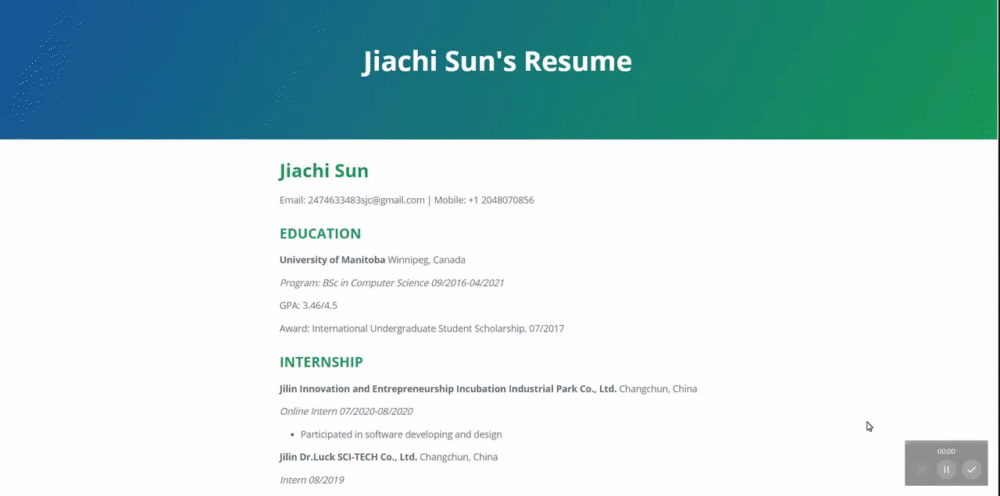

# How to host a resume on GitHub Pages

## Purpose:

1. A step-by-step detailed introduction of how to host your own resume page on GitHub Pages.

2. How do the steps correspond to Andrew Etter's book _Modern Technical Writing_

## Content:
- [Prerequisites](#Prerequisites)
- [Instructions](#Instructions)
- [More Resources](#More-Resources)
- [Authors and Acknowledgments](#Authors-and-Acknowledgments)
- [FAQs](#faqs)

## Prerequisites:

1. GitHub account
    - You need to log in to create a repository on GitHub and create our web resume. You need an email address to create a GitHub account.
2. Resume in Markdown format
    - In the following introduction, it will be assumed that you already have a resume in Markdown format. If you do not have a resume in Markdown format, please complete this prerequisite first. If you have no experience in writing Markdown format files, I have given a link in [More Resources](#More-Resources) to help you get started quickly.
3. Some basic knowledge of Jekyll would be better
    - If you have no relevant experience, do not worry! This will not force you to pause like the previous prerequest. Creating a basic resume does not require much knowledge of Jekyll. In the future, you can slowly beautify your website by learning Jekyll knowledge and using them. I have given a link of Jekyll tutorial in [More Resources](#More-Resources).

## Instructions:

This is the resume page I created through the following steps.

1. Go to your GitHub account and create a new repository in this format: `youraccountName.github.io`

    - To create a new repository, click on the plus icon in the upper right corner and select New Repository.
    - The reason why we choose GitHub to host a resume is that GitHub is built base on the Git. Git is a distributed version control system. This is also the view mentioned by Etter in the book Modern Technical Writing: use the cersion control system. It is easier to update your resume on GitHub. Any new changes will also be quickly reflected on the GitHub page. The resume page will always be synchronized with your resume file.

2. Upload the resume that has been written by clicking the Add File button. Also rename it to `index.md`

    - Every time you add new content or update your resume, you can delete the original file and upload the new file or modify it directly in `index.md`. This is another reason why you choose GitHub. According to Etter, unlike pdf files that cannot be modified once they are created, you can modify the content hosted on the website at will. On GitHub Pages, you can update your resume at will by modifying `index.md`.

3. Create a new file: `_config.yml`

    - This is the file that can modify you resume page's style, title …
    - Because GitHub is set to work with Jekyll. So even if Jekyll has little knowledge, it will not affect the completion of hosting a resume on GitHub Pages. By directly selecting your favorite theme on the settings page, GitHub will automatically apply it to the resume page. If you are interested in learning Jekyll more deeply, you can check out the link in [More Resources](#More-Resources).
    - It is worth mentioning that the static GitHub Page generated by Jekyll as a static website generator has many advantages. According to Etter, by and without application dependent. The speed of static web pages is very fast, and the stability is very high. At the same time, because there is no database, it is difficult for hackers to steal data from the website, which provides high security.

4. Publish GitHub Pages in the settings interface

    - Select setting, and then scroll down the page to Github Pages. Select main for Branch and root for file. Click the save button. Your website will generally be accessible within a short period of time.
    - Remember to constantly update and revise your resume. With constant changes and addition of new content. Your resume page will become richer and more perfect.

5. Visit your resume page

    - When your page is successfully published. You can access your resume page by entering `youraccountName.github.io` in your browser.

# More Resources:

1. [Markdown tutorial](https://www.markdowntutorial.com/)
2. [Andrew Etter's book](https://www.amazon.ca/Modern-Technical-Writing-Introduction-Documentation-ebook/dp/B01A2QL9SS)
3. [Mike Dane's Jekyll tutorial](https://www.youtube.com/playlist?list=PLLAZ4kZ9dFpOPV5C5Ay0pHaa0RJFhcmcB)

# Authors and Acknowledgments: 

- Andrew Etter
- Cayman theme ([GitHub Pages theme](https://github.com/Sun1030/sun1030.github.io/settings/pages/themes?select=cayman&source=main&source_dir=%2F))
- Group members
    - Connor Gehman
    - Quoc Nguyen
    - Sebastian Araneda

## FAQs:

1. Why is Markdown better than a word processor?

    - Markdown is a lightweight markup language. You can easily master this language with some practice. Markdown is completely free. And it is outstanding in every aspect compared to a word processor. First of all, Markdown is very lightweight, unlike a word processor, and you may need to install it first to use it. But for Markdown, if you do not want to install the application, you can use many web markdown editors. Secondly, for writing Markdown files, all you need to do is write. Whether you want to insert a table, want some text to be captioned, want to insert a link, want to insert an image, or want to create numbering lists, you can do all of this in Markdown by typing. But in a word processor, you may have to search through dozens of buttons for different functions to find what you need. Third, word processor compatibility on different operating systems can be a concern. But Markdown has no problems, is compatible with any operating system, and has no formatting issues.

2. Why is my resume not showing up?

    - Since this is your first time using GitHub Pages, it may take a few hours to a few minutes to create your site, so please be patient and wait until you are sure there is no problem. Also, please make sure there is nothing wrong with the file `_config.yml`, there is no debugger for Jekyll in GitHub, so if there is a problem with the file, it won't show up when you save it. So, your resume will not show up when you are creating the page. Also, make sure that the GitHub Pages section of the setting page shows that your page has been successfully published. If not, check that you have selected the main for Branch and root for the file. Lastly, make sure that your resume was uploaded successfully and named `index.md`. This is because during the website creation process, the content of `index.md` is read and displayed on the page. If the read fails, then your page will not be displayed successfully.
    
3. Should my repository also include a `README.md` like this one?
    - Sure! You can also introduce a readme like this to let more people know and learn how to host their resumes on GitHub. I believe that in the process of writing the README file, it can also help you deepen your understanding of the entire process.
 
    
